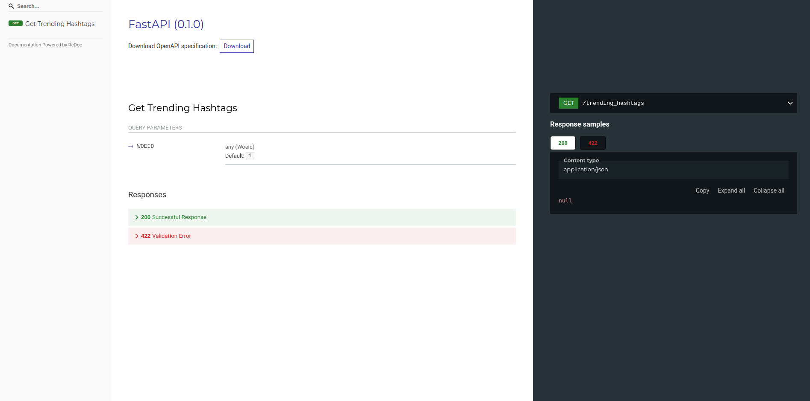

# Twitter Country's Trending Hashtags API

## Documentation


Returns the top 50 trending topics for a specific WOEID. 

Get Trending Hashtags endpoint success output:
```json
{
    "trends": [
      {
        "name": "#GiftAGamer",
        "url": "http://twitter.com/search?q=%23GiftAGamer",
        "promoted_content": null,
        "query": "%23GiftAGamer",
        "tweet_volume": null
      },
      {
        "name": "#AskCuppyAnything",
        "url": "http://twitter.com/search?q=%23AskCuppyAnything",
        "promoted_content": null,
        "query": "%23AskCuppyAnything",
        "tweet_volume": 14504
      },
    ]
    "as_of": "2020-11-20T19:37:52Z",
    "created_at": "2020-11-19T14:15:43Z",
    "locations": [
      {
        "name": "Worldwide",
        "woeid": 1
      }
    ]
}
```

**Data:**
- Twitter API v1 <a href="https://developer.twitter.com/en/docs/twitter-api/v1/trends/trends-for-location/api-reference/get-trends-place">GET trends/place</a>

## Run
Two ways to run the api:

bash run.sh:
```sh
    $ python -m venv .venv
    $ source .venv/bin/activate
    $ pip install -r requirements.txt
    $ uvicorn app:app --host 127.0.0.1 --port 9002 --reload
```
Or

docker container:
```docker
    $ docker build . -t trending-hashtags-service
    $ docker run -p 9002:9002 -d --name trending-hashtags-service trending-hashtags-service
``` 

## Environment Variables
For accessing the api, you need to set the following environment variables from the twitter account:
- `CONSUMER_KEY`: 
- `CONSUMER_SECRET`: 
- `ACCESS_TOKEN`: 
- `ACCESS_SECRET`: 

